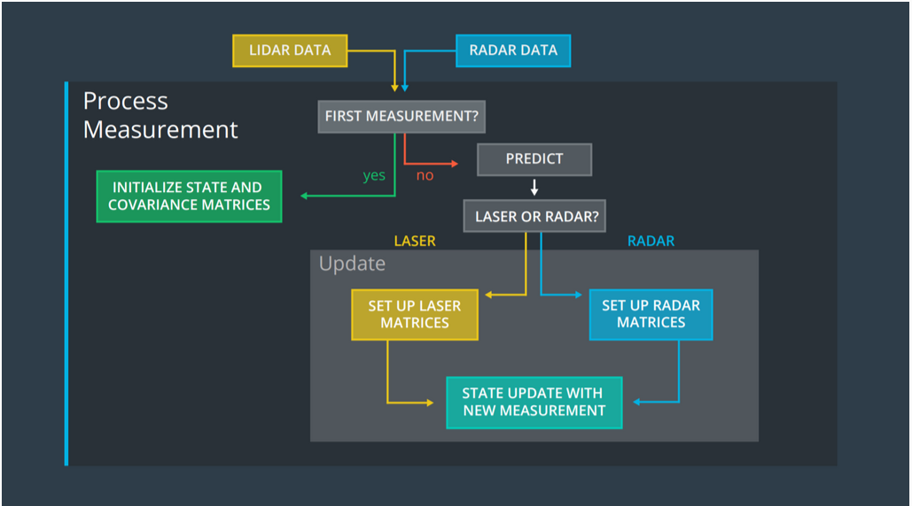
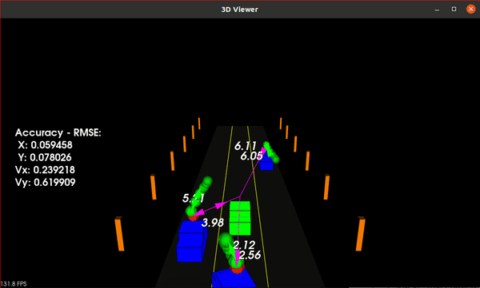
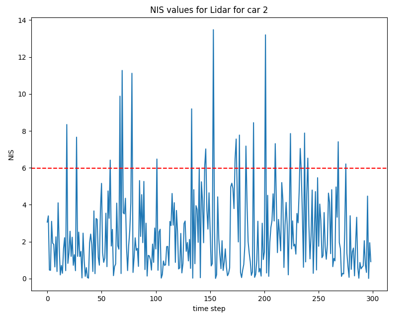
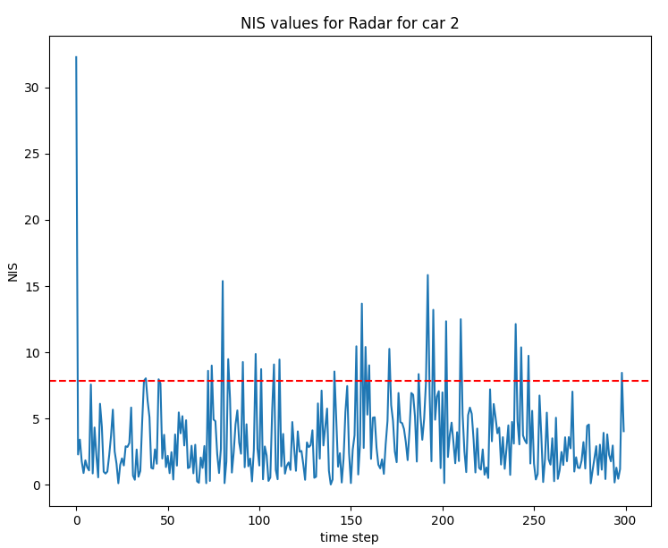

## Unscented Kalman Filter Project for LiDAR and Radar Fusion

This project is a part of the Udacity Self-Driving Car Nanodegree Program. The goal of this project is to implement an Unscented Kalman Filter to estimate the state of a moving object of interest with noisy LiDAR and Radar measurements.

The map of the UKF project is shown below:



The Normalized Innovation Squared (NIS) values for LiDAR and Radar measurements are plotted using the python wrapper for the C++ code built using pybind11.

## Installation

1. Clone the project repository and open the project:

    ```bash
    git clone https://github.com/arunmadhusud/LiDAR-RADAR-Fusion-UKF.git
    cd LiDAR-RADAR-Fusion-UKF
    ```

2. Clone the pybind11 repository:

    ```bash
    git clone https://github.com/pybind/pybind11.git
    ```

3. Build the project:

    ```bash
    mkdir build && cd build
    cmake ..
    make
    ```

4. Run the project:

    ```bash
    ./ukf_highway
    ```

## Results

The gif below shows the results of the tracking using the Unscented Kalman Filter:



The green vehicle in the animation represents the ego vehicle, and the blue vehicle represents the tracked object. The red dots represent the LiDAR measurement. The green spheres then show the predicted position for the car in the future over a 2 second interval. The number of green spheres represents the number of positions to interpolate the time interval.

The RMSE values for the UKF are also shown in the gif. 

The NIS values for LiDAR and Radar measurements for car 2 the assumed UKF parameters are shown below:





The NIS values obtained for the LiDAR and Radar measurements are within the 95% confidence interval, which indicates that the UKF is working as expected.

## Acknowledgements

The project was developed as a part of the Udacity Self-Driving Car Nanodegree Program. The project uses the visualization code provided by Udacity. The UKF implementation is based on the code provided in the lectures.


